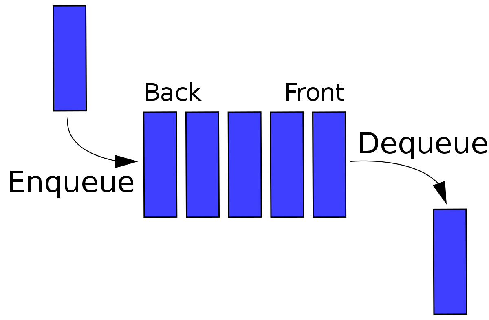

# Day 6: Tuning Trouble

The preparations are finally complete; you and the Elves leave camp on foot and begin to make your way toward the *star* fruit grove.

As you move through the dense undergrowth, one of the Elves gives you a handheld *device*. He says that it has many fancy features, but the most important one to set up right now is the *communication system*.

However, because he's heard you have [significant](https://adventofcode.com/2016/day/6) [experience](https://adventofcode.com/2016/day/25) [dealing](https://adventofcode.com/2019/day/7) [with](https://adventofcode.com/2019/day/9) [signal-based](https://adventofcode.com/2019/day/16) [systems](https://adventofcode.com/2021/day/25), he convinced the other Elves that it would be okay to give you their one malfunctioning device - surely you'll have no problem fixing it.

As if inspired by comedic timing, the device emits a few colorful sparks.

To be able to communicate with the Elves, the device needs to *lock on to their signal*. The signal is a series of seemingly-random characters that the device receives one at a time.

To fix the communication system, you need to add a subroutine to the device that detects a *start-of-packet marker* in the datastream. In the protocol being used by the Elves, the start of a packet is indicated by a sequence of *four characters that are all different*.

The device will send your subroutine a datastream buffer (your puzzle input); your subroutine needs to identify the first position where the four most recently received characters were all different. Specifically, it needs to report the number of characters from the beginning of the buffer to the end of the first such four-character marker.

For example, suppose you receive the following datastream buffer:

```
mjqjpqmgbljsphdztnvjfqwrcgsmlb
```

After the first three characters (`mjq`) have been received, there haven't been enough characters received yet to find the marker. The first time a marker could occur is after the fourth character is received, making the most recent four characters `mjqj`. Because `j` is repeated, this isn't a marker.

The first time a marker appears is after the *seventh* character arrives. Once it does, the last four characters received are `jpqm`, which are all different. In this case, your subroutine should report the value `*7*`, because the first start-of-packet marker is complete after 7 characters have been processed.

Here are a few more examples:

- `bvwbjplbgvbhsrlpgdmjqwftvncz`: first marker after character `*5*`
- `nppdvjthqldpwncqszvftbrmjlhg`: first marker after character `*6*`
- `nznrnfrfntjfmvfwmzdfjlvtqnbhcprsg`: first marker after character `*10*`
- `zcfzfwzzqfrljwzlrfnpqdbhtmscgvjw`: first marker after character `*11*`

*How many characters need to be processed before the first start-of-packet marker is detected?*

### Solution

For this problem, we are given a long string of characters, and we are asked to find 4 consecutive characters that are all different. There are many ways that you can solve this challenge, and I will explain my solution.

```perl
open(my $fh, '<', "input.txt") or die $!;
my @line = split("", <$fh>);
close($fh);
```

We start by reading the first and only line of the input, and splitting it into a character array to be able to work with it.

```perl
my $offset = -1;
my $char = $line[0];
my $position = 1;
my @queue = ();
```

Then, we set the offset to -1 (the offset will be explained later on), the char to the first char in the input, the position to 1 (since we already read the first char), and finally the queue to be empty.

It is worth mentioning that for this challenge, we use a datatype called a [queue](https://en.wikipedia.org/wiki/Queue_%28abstract_data_type%29). This is better than an array because we want to slowly iterate through each element of the input, getting the next element, while removing the last one. 



Before we continue, it is important to understand what offset is. If you have the following string: "bcaagef", You will notice that the third and fourth characters are the same. So why should we iterate through each of these options: "bcaa", "caag", "aage", if we already know each of them will not be valid since they will have "aa". This is the purpose of offset: the repeat is the 3rd character, so we can pop the last 3 characters, and append 3 new characters to skip all the repeats. Offset isn't just a time save for this solution, it's vital to have it, since we don't check our queue for repeats.

```perl
while ($offset != -1 or scalar @queue != 3) {
    push(@queue, $char);
    for (0..$offset) { shift(@queue); }
    $char = $line[$position];
    $position++;
    $offset = first_index { $_ eq $char } @queue;
}
```

This is the core of the code. As you can see, this loop will continue until offset is -1, meaning that there were no repeats; and queue has a length of 3, meaning we have a full queue, and the next character is different from anything we currently have. We start by pushing the current character into the queue, and removing an **offset** number of characters to skip the repeats. Then, we set the char to the next character, and increment the position. Finally, we find the index at which the character appears in our queue. If it doesn't appear, then offset is set to -1, and the loop in the next iteration will not occur. I believe this is an O(n) solution where n is the length of the input, and r (the number of consecutive different characters we need) doesn't impact the solution, but if I am wrong, then please correct me.

## Part 2

Your device's communication system is correctly detecting packets, but still isn't working. It looks like it also needs to look for *messages*.

A *start-of-message marker* is just like a start-of-packet marker, except it consists of *14 distinct characters* rather than 4.

Here are the first positions of start-of-message markers for all of the above examples:

- `mjqjpqmgbljsphdztnvjfqwrcgsmlb`: first marker after character `*19*`
- `bvwbjplbgvbhsrlpgdmjqwftvncz`: first marker after character `*23*`
- `nppdvjthqldpwncqszvftbrmjlhg`: first marker after character `*23*`
- `nznrnfrfntjfmvfwmzdfjlvtqnbhcprsg`: first marker after character `*29*`
- `zcfzfwzzqfrljwzlrfnpqdbhtmscgvjw`: first marker after character `*26*`

*How many characters need to be processed before the first start-of-message marker is detected?*

### Solution

Part 2 isn't worth explaining. The solution is the exact same, except we now check for 14 characters, instead of 4. In fact, here is a generalized solution that works with any **r** amount of consecutive different characters.

```perl
use List::MoreUtils qw(first_index);

open(my $fh, '<', "input.txt") or die $!;
my @line = split("", <$fh>);
close($fh);

my $offset = -1;
my $position = 1;
my @queue = ();
my $char = $line[0];

my $r = 4 # The amount of consecutive different characters

while ($offset != -1 or scalar @queue != ($r - 1)) {
    push(@queue, $char);
    for (0..$offset) { shift(@queue); }
    $char = $line[$position];
    $position++;
    $offset = first_index { $_ eq $char } @queue;
}
print "$position\n";
```

### Note:

Both the solution for part 1 and part 2 use [List::MoreUtils](https://metacpan.org/pod/List::MoreUtils).
